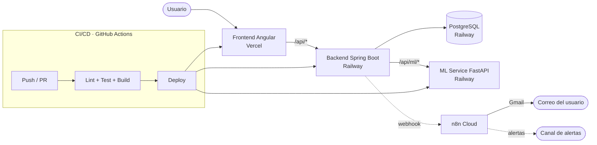
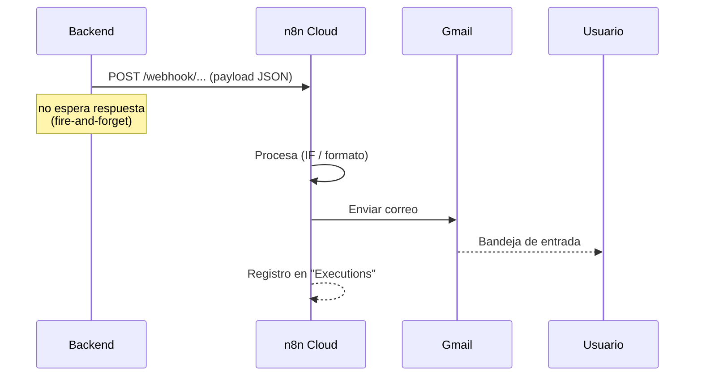
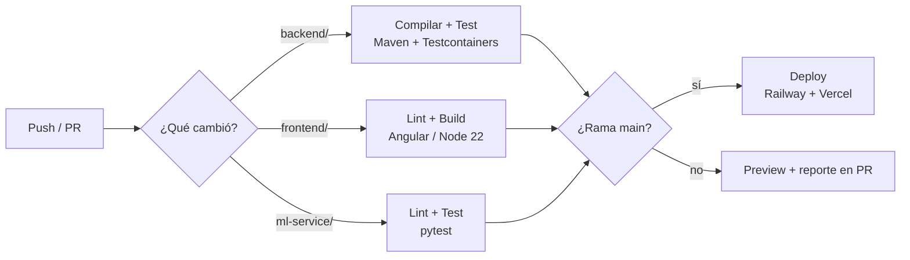

# Sinapsistencia — Automatización (n8n) y CI/CD

**Documento de referencia para el equipo.** Describe el _estado objetivo_ del
sistema de automatización con n8n y del pipeline de integración/despliegue
continuo, redactado como si ya estuviera operativo. La **sección 5** traduce esto
en un backlog listo para el tablero (épicas, historias y tareas).

> Convención de estado usada en las tablas:
> **✅ En código** (ya implementado en el repo) · **⚙️ Por configurar** (falta el
> setup operativo) · **📝 Por construir** (aún no existe).

---

## 1. Panorama del sistema

Sinapsistencia es un monorepo con tres aplicaciones desplegadas y dos servicios
gestionados de automatización/entrega.



| Componente   | Tecnología                    | Hosting   | Rol |
|--------------|-------------------------------|-----------|-----|
| Frontend     | Angular 21 (standalone/signals) | Vercel  | SPA + proxy `/api/*` → backend |
| Backend      | Spring Boot 3.5 / Java 21     | Railway   | API REST, dominio clínico-legal |
| ML Service   | FastAPI / Python              | Railway   | Clasificación de riesgo + matching |
| Base de datos| PostgreSQL 16 (+pgvector)     | Railway   | Persistencia (migraciones Flyway) |
| Automatización | n8n Cloud                   | n8n.cloud | Correos + alertas (webhooks) |
| Correo       | Gmail (OAuth vía n8n)         | Google    | Entrega de correos transaccionales |

---

## 2. Automatización con n8n

### 2.1 Principio de integración: _fire-and-forget_

El backend nunca depende de n8n para completar una operación. Cada disparo es
asíncrono (`@Async`), con timeout corto y **no lanza excepción**: si n8n está
caído o no configurado, la funcionalidad principal (registro, login, solicitudes)
sigue intacta. Los disparadores viven en:

- `notifications/MailNotifier.java` — correos transaccionales.
- `ml/application/N8nNotifier.java` — alertas de riesgo.



### 2.2 Catálogo de flujos

Dos webhooks concentran los cinco flujos. El backend arma asunto y HTML de los
correos; n8n los entrega.

| # | Flujo | Webhook (path) | Disparado desde | Destinatario | Estado |
|---|-------|----------------|-----------------|--------------|--------|
| 1 | Alerta de riesgo alto/crítico | `/webhook/risk-alert` | `POST /api/ml/risk` cuando `riskLevel ∈ {alto, critico}` | Equipo / canal de alertas | ✅ En código · ⚙️ Por configurar |
| 2 | Recuperación de contraseña | `/webhook/sinapsistencia-mail` | `POST /api/auth/forgot-password` | Usuario de la cuenta | ✅ En código · ⚙️ Por configurar |
| 3 | Bienvenida | `/webhook/sinapsistencia-mail` | `POST /api/auth/register` | Nuevo usuario | ✅ En código · ⚙️ Por configurar |
| 4 | Solicitud de contacto recibida | `/webhook/sinapsistencia-mail` | `POST /api/contact-requests` | Abogado destinatario | ✅ En código · ⚙️ Por configurar |
| 5 | Solicitud de contacto respondida | `/webhook/sinapsistencia-mail` | `PATCH /api/contact-requests/{id}` | Médico solicitante | ✅ En código · ⚙️ Por configurar |

### 2.3 Detalle por flujo

#### Flujo 1 — Alerta de riesgo alto/crítico

- **Objetivo:** notificar de inmediato cuando la evaluación ML de un caso arroja
  riesgo `alto` o `critico`, para priorizar la atención legal.
- **Nodos n8n:** `Webhook (risk-alert)` → `IF (riesgo alto/crítico)` → nodo de
  notificación (correo/Slack/etc.).
- **Payload:**

  ```json
  {
    "caseId": "…", "riskScore": 0.87, "riskLevel": "critico",
    "riskFactors": ["…"], "recommendations": ["…"],
    "specialty": "Ginecología y Obstetricia",
    "doctorName": "Dra. Valentina Rojas", "doctorEmail": "…",
    "documentationComplete": true, "informedConsent": true,
    "evaluatedAt": "2026-07-04T08:00:00Z"
  }
  ```

#### Flujo 2 — Recuperación de contraseña

- **Objetivo:** enviar enlace + token para restablecer la contraseña (caduca 1 h).
- **Nodos n8n:** `Webhook (sinapsistencia-mail)` → `Gmail (Send)`.
- **Nota de seguridad:** con n8n configurado, el token viaja **solo por correo**
  y no se expone en la respuesta HTTP. Sin n8n (dev local) vuelve como fallback.
- **Payload:** `type=password_reset`, `to`, `name`, `subject`, `html`, `token`,
  `resetLink`.

#### Flujo 3 — Bienvenida

- **Objetivo:** confirmar el alta de cuenta y guiar al panel.
- **Nodos n8n:** `Webhook (sinapsistencia-mail)` → `Gmail (Send)`.
- **Payload:** `type=welcome`, `to`, `name`, `subject`, `html`, `role`.

#### Flujo 4 — Solicitud de contacto recibida (→ abogado)

- **Objetivo:** avisar al abogado que un médico le envió una solicitud.
- **Payload:** `type=contact_request_received`, `to`, `name` (abogado),
  `doctorName`, `caseTitle`, `subject`, `html`.

#### Flujo 5 — Solicitud de contacto respondida (→ médico)

- **Objetivo:** informar al médico si su solicitud fue **aceptada** o **rechazada**
  (incluye el mensaje del abogado).
- **Payload:** `type=contact_request_answered`, `to`, `name` (médico),
  `lawyerName`, `caseTitle`, `accepted` (bool), `subject`, `html`.

### 2.4 Configuración operativa (resumen)

- **Hosting:** n8n Cloud (URL pública, alcanzable desde Railway).
- **Credencial:** Gmail vía OAuth gestionado por n8n Cloud (un clic).
- **Variables de entorno del backend:**
  - `N8N_WEBHOOK_URL` = base pública de n8n (sin path).
  - `APP_FRONTEND_URL` = dominio de Vercel (para los enlaces de los correos).
- Detalle paso a paso en [`docs/n8n-correos-setup.md`](n8n-correos-setup.md).

---

## 3. CI/CD (GitHub Actions)

### 3.1 Estrategia de ramas

| Rama | Propósito | Despliegue |
|------|-----------|-----------|
| `main` | Código estable, listo para producción | Auto-deploy a producción (Railway + Vercel) |
| `feature/*` | Desarrollo de historias | Preview deploy (Vercel) + CI en el PR |
| `fix/*` | Correcciones | Igual que feature |

- Trabajo por **Pull Request** hacia `main`. El PR **no se puede fusionar** si el
  pipeline (lint + test + build) falla → _branch protection_.
- Convención de commits y PRs vinculados a la historia del tablero (ej. `HU-04`).

### 3.2 Etapas del pipeline



### 3.3 Workflows por servicio

| Workflow | Trigger | Pasos | Estado |
|----------|---------|-------|--------|
| `ci-backend.yml` | PR/push que toque `backend/**` | JDK 21 → `mvnw verify` (usa Testcontainers) → cache Maven | 📝 Por construir |
| `ci-frontend.yml` | PR/push que toque `frontend/**` | Node 22 → `npm ci` → `npm run build` (+ `npm test` headless) | 📝 Por construir |
| `ci-ml.yml` | PR/push que toque `ml-service/**` | Python 3.x → `pip install -r requirements.txt` → `pytest` | 📝 Por construir |
| `deploy.yml` | push a `main` | Espera CI verde → dispara deploy Railway/Vercel | 📝 Por construir |

> Optimización: los jobs se filtran por rutas (`paths:`) para no correr el CI del
> backend cuando solo cambia el frontend.

### 3.4 Entornos y secretos

Configurados como _GitHub Secrets_ (nunca en el repo):

| Secreto | Uso |
|---------|-----|
| `RAILWAY_TOKEN` | Deploy del backend y ml-service |
| `VERCEL_TOKEN`, `VERCEL_ORG_ID`, `VERCEL_PROJECT_ID` | Deploy del frontend |
| `N8N_WEBHOOK_URL`, `APP_FRONTEND_URL` | Se setean en Railway, no en Actions |

Las variables de runtime (`DB_URL`, `JWT_SECRET`, `CLOUDINARY_URL`,
`N8N_WEBHOOK_URL`, `APP_FRONTEND_URL`, etc.) viven en Railway/Vercel, no en CI.

### 3.5 Despliegue

- **Frontend → Vercel:** ya conectado a GitHub; cada push a `main` publica
  producción y cada PR genera preview. `vercel.json` reescribe `/api/*` al backend.
- **Backend + ML → Railway:** deploy desde `main`. Migraciones Flyway corren al
  arranque (validación de esquema con Hibernate `ddl-auto: validate`).

---

## 4. Calidad y "Definición de Done"

Una historia se considera **Done** cuando:

- [ ] Código en un PR revisado y aprobado por al menos 1 compañero.
- [ ] CI en verde (lint + test + build de los servicios afectados).
- [ ] Sin secretos hardcodeados; variables nuevas documentadas en `.env.example`.
- [ ] Criterios de aceptación de la historia verificados (manual o test).
- [ ] Documentación actualizada si aplica (`docs/`).
- [ ] Desplegado en `main` sin romper el _health check_ (`/actuator/health`).

---

## 5. Backlog sugerido (base para el tablero)

Estructura para Kanban/Scrum. IDs propuestos: **AUT** (automatización n8n),
**CI** (integración/despliegue continuo).

### 5.1 Épicas

| Épica | Descripción | Historias |
|-------|-------------|-----------|
| **E-AUT** Automatización de comunicaciones | Correos transaccionales y alertas vía n8n | AUT-01 … AUT-07 |
| **E-CI** Pipeline CI/CD | Integración y despliegue continuo con GitHub Actions | CI-01 … CI-06 |

### 5.2 Historias — Automatización (n8n)

> **AUT-01 · Provisionar n8n Cloud**
> _Como_ equipo de plataforma _quiero_ un espacio n8n Cloud con Gmail conectado
> _para_ poder enviar correos desde los workflows.
> **Criterios:** workspace creado; credencial Gmail OAuth funcionando; URL pública
> documentada. **Estado:** ⚙️ Por configurar.

> **AUT-02 · Workflow de correos (`sinapsistencia-mail`)**
> _Como_ sistema _quiero_ un webhook que reciba `{to, subject, html}` y envíe por
> Gmail _para_ entregar los correos transaccionales.
> **Criterios:** webhook activo; prueba con `curl` entrega correo; ejecución
> visible en Executions. **Estado:** ⚙️ Por configurar.

> **AUT-03 · Correo de recuperación de contraseña**
> _Como_ usuario _quiero_ recibir un enlace para restablecer mi contraseña _para_
> recuperar el acceso.
> **Criterios:** al pedir recuperación llega el correo con enlace válido (1 h); el
> token no se expone en la respuesta cuando n8n está activo. **Estado:** ✅ En código.

> **AUT-04 · Correo de bienvenida**
> _Como_ nuevo usuario _quiero_ un correo de bienvenida _para_ confirmar mi alta.
> **Criterios:** el registro dispara el correo; contenido según rol. **Estado:** ✅ En código.

> **AUT-05 · Correo de solicitud de contacto recibida**
> _Como_ abogado _quiero_ un correo cuando recibo una solicitud _para_ responder a
> tiempo. **Criterios:** al crear la solicitud, el abogado recibe correo con datos
> del médico/caso. **Estado:** ✅ En código.

> **AUT-06 · Correo de respuesta a la solicitud**
> _Como_ médico _quiero_ saber por correo si mi solicitud fue aceptada/rechazada
> _para_ continuar el caso. **Criterios:** al responder, el médico recibe correo con
> el resultado y mensaje. **Estado:** ✅ En código.

> **AUT-07 · Alerta de riesgo alto/crítico**
> _Como_ equipo _quiero_ una alerta automática ante casos de riesgo alto/crítico
> _para_ priorizarlos. **Criterios:** `POST /api/ml/risk` con riesgo alto/crítico
> dispara la alerta; el resto no. **Estado:** ✅ En código · ⚙️ Workflow por activar.

### 5.3 Historias — CI/CD

> **CI-01 · Branch protection en `main`**
> Reglas: PR obligatorio, 1 review, CI verde para fusionar. **Estado:** 📝 Por construir.

> **CI-02 · CI Backend** — `ci-backend.yml`: JDK 21, `mvnw verify` con
> Testcontainers, cache Maven, filtro `paths: backend/**`. **Estado:** 📝 Por construir.

> **CI-03 · CI Frontend** — `ci-frontend.yml`: Node 22, `npm ci`, `npm run build`,
> test headless, filtro `paths: frontend/**`. **Estado:** 📝 Por construir.

> **CI-04 · CI ML Service** — `ci-ml.yml`: Python, instalar deps, `pytest`, filtro
> `paths: ml-service/**`. **Estado:** 📝 Por construir.

> **CI-05 · Deploy automático desde `main`** — Railway (backend + ML) y Vercel
> (frontend) tras CI verde. **Estado:** 📝 Por construir (Vercel ya auto-despliega).

> **CI-06 · Gestión de secretos** — cargar `RAILWAY_TOKEN`, `VERCEL_*` en GitHub
> Secrets; auditar que no haya secretos en el repo. **Estado:** 📝 Por construir.

### 5.4 Tareas técnicas transversales

- [ ] Crear carpeta `.github/workflows/` con los 4 workflows.
- [ ] Añadir badge de estado de CI al `README`.
- [ ] Definir matriz de entornos (dev/preview/prod) y sus variables.
- [ ] Documentar el runbook: "qué hacer si un deploy falla".
- [ ] Exportar los workflows de n8n a `n8n/` (versionar los JSON).

### 5.5 Estados sugeridos del tablero Kanban

```
Backlog  →  Por hacer  →  En progreso  →  En revisión (PR)  →  QA / Verificación  →  Done
```

- **En revisión (PR):** CI corriendo + review de un compañero.
- **QA / Verificación:** validación de criterios de aceptación en preview/prod.
- **Done:** cumple la Definición de Done (sección 4).

---

## 6. Referencias

- Configuración n8n paso a paso: [`docs/n8n-correos-setup.md`](n8n-correos-setup.md)
- Disparadores de correo: `backend/src/main/java/pe/sinapsistencia/notifications/`
- Disparador de alertas: `backend/src/main/java/pe/sinapsistencia/ml/application/N8nNotifier.java`
- Workflow de riesgo (JSON): `n8n/workflow-alerta-riesgo-alto.json`
