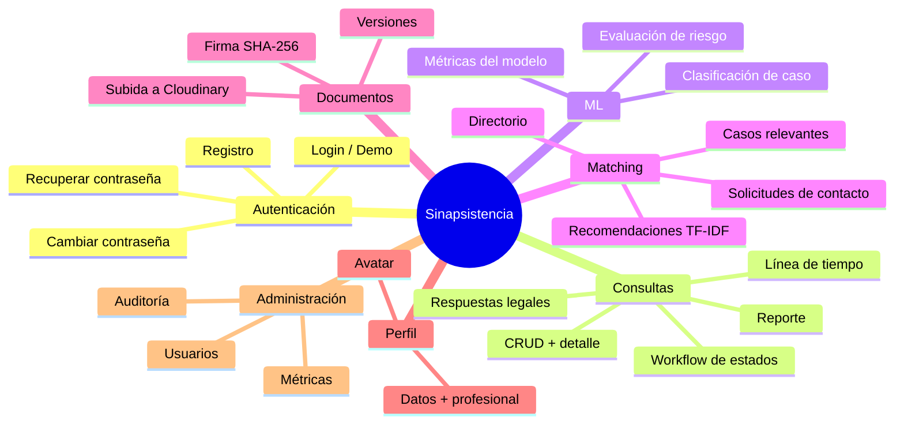
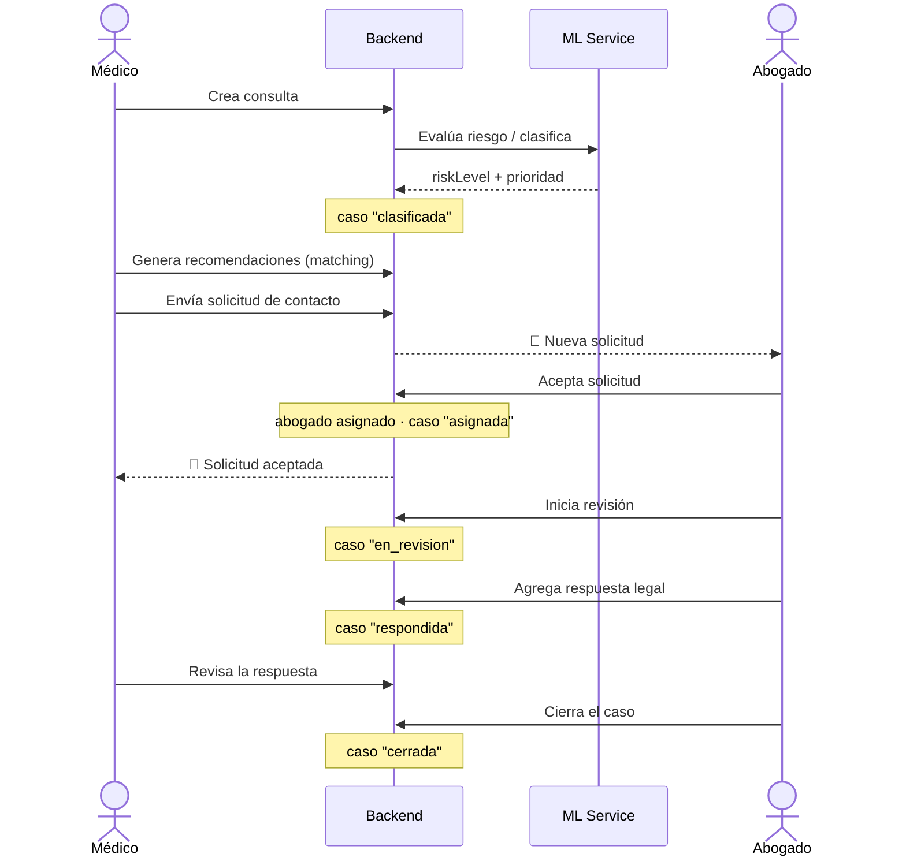
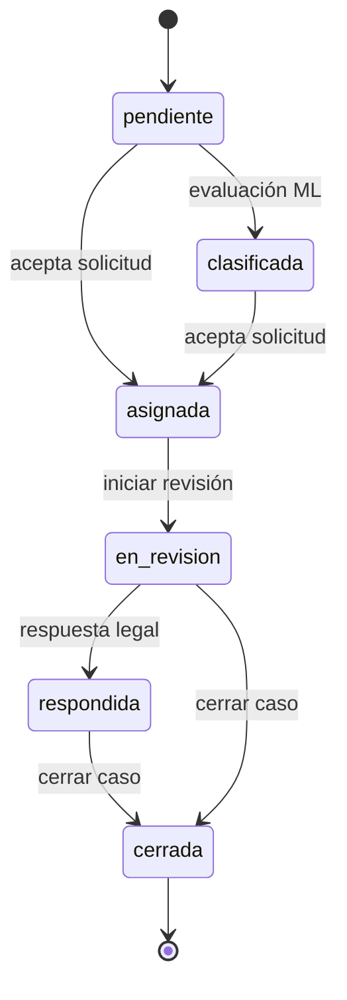
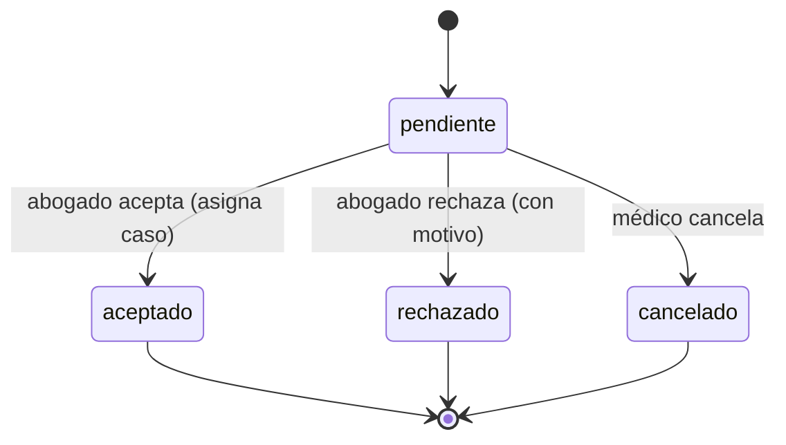
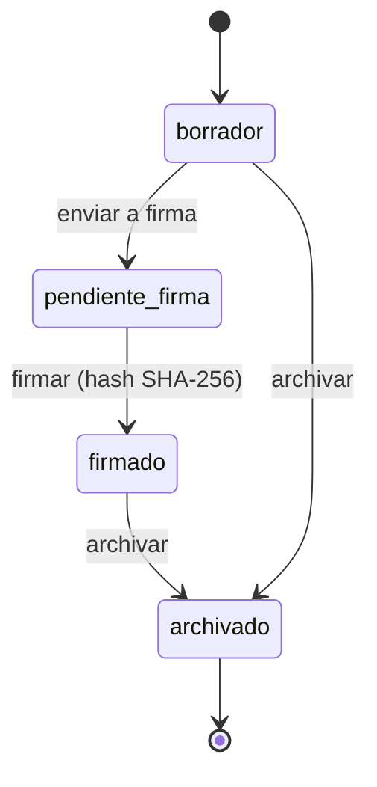
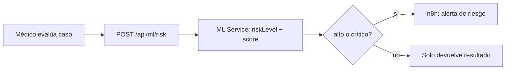
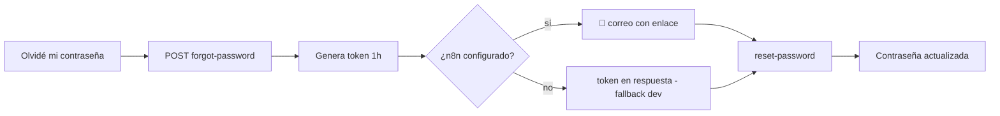

# Sinapsistencia — Funcionalidades y Flujos

**Documento de referencia funcional.** Cataloga todas las funcionalidades de la
plataforma, sus flujos de negocio end-to-end, las máquinas de estado y el mapa de
API/pantallas. Complementa a [`automatizacion-n8n-y-cicd.md`](automatizacion-n8n-y-cicd.md)
(automatización + entrega) y a [`n8n-correos-setup.md`](n8n-correos-setup.md).

Sinapsistencia conecta **médicos** que enfrentan un posible reclamo clínico-legal
con **abogados** especializados, apoyándose en un modelo de ML para clasificar el
riesgo y recomendar al profesional adecuado.

---

## 1. Roles y accesos

| Rol | Quién es | Puede |
|-----|----------|-------|
| **Médico** (`doctor`) | Profesional de salud | Crear/gestionar sus consultas, evaluar riesgo, buscar y contactar abogados, gestionar sus documentos |
| **Abogado** (`lawyer`) | Asesor legal | Ver solicitudes recibidas, aceptar/rechazar, atender casos asignados, responder, ver documentos del caso |
| **Admin** (`admin`) | Operación de la plataforma | Gestionar usuarios, ver métricas del modelo, auditoría, y todos los recursos |

Autenticación por **JWT en cookie httpOnly** (`access_token`) + token en el body.
Hay login por **email/contraseña** y login **demo por rol** (cuentas seed).

---

## 2. Mapa de módulos

---

## 3. Funcionalidades por módulo

### 3.1 Autenticación y cuenta

| Funcionalidad | Endpoint | Notas |
|---------------|----------|-------|
| Login email/contraseña | `POST /api/auth/login` | Devuelve usuario + JWT (cookie) |
| Login demo por rol | `POST /api/auth/login` (`role`) | Cuentas seed doctor/lawyer/admin |
| Cerrar sesión | `POST /api/auth/logout` | Expira la cookie |
| Perfil de sesión | `GET /api/auth/me` | Datos frescos desde el token |
| Registro | `POST /api/auth/register` | doctor o lawyer; dispara **correo de bienvenida** |
| Solicitar recuperación | `POST /api/auth/forgot-password` | Genera token 1 h; dispara **correo de recuperación** |
| Restablecer contraseña | `POST /api/auth/reset-password` | Valida token + email |
| Cambiar contraseña | `POST /api/auth/change-password` | Autenticado; valida la actual |

### 3.2 Consultas (casos legales)

| Funcionalidad | Endpoint | Rol |
|---------------|----------|-----|
| Listar consultas (con filtros) | `GET /api/legal-cases` | Ownership por rol |
| Crear consulta | `POST /api/legal-cases` | Médico |
| Ver consulta | `GET /api/legal-cases/{id}` | Ownership |
| Detalle (contexto + timeline + respuestas) | `GET /api/legal-cases/{id}/detail` | Ownership |
| Reporte del caso | `GET /api/legal-cases/{id}/report` | Ownership |
| Actualizar / editar | `PUT /api/legal-cases/{id}` · `/edit` | Médico/Admin |
| Iniciar revisión | `POST /api/legal-cases/{id}/start-review` | Abogado asignado |
| Cerrar caso | `POST /api/legal-cases/{id}/close` | Abogado/Admin |
| Agregar evento (timeline) | `POST /api/legal-cases/{id}/events` | Participantes |
| Agregar respuesta legal | `POST /api/legal-cases/{id}/responses` | Abogado |
| Revisar respuesta | `PATCH /api/legal-cases/{id}/responses/{rid}/review` | Médico |

### 3.3 ML — riesgo y clasificación

| Funcionalidad | Endpoint | Notas |
|---------------|----------|-------|
| Evaluación de riesgo | `POST /api/ml/risk` | Proxy a FastAPI; si riesgo alto/crítico → **alerta n8n** |
| Salud del servicio ML | `GET /api/ml/health` | Indicador de disponibilidad |
| Métricas del modelo | `GET /api/ml/metrics` | Solo **Admin** |

La **clasificación** de un caso (nivel de riesgo + prioridad) se resuelve vía el
servicio ML; existe además una vía de reglas de respaldo (`CaseClassificationService`)
si el ML no responde.

### 3.4 Matching médico-abogado

| Funcionalidad | Endpoint | Rol |
|---------------|----------|-----|
| Directorio de médicos | `GET /api/matching/doctors` | Abogado |
| Directorio de abogados | `GET /api/matching/lawyers` | Médico |
| Generar recomendaciones (TF-IDF + coseno) | `POST /api/matching/lawyers` | Médico |
| Casos relevantes para un abogado | `GET /api/matching/relevant-cases` | Abogado |

El matching usa **TF-IDF + similitud coseno** entre las áreas del caso y las
especialidades/áreas médicas de cada abogado.

### 3.5 Solicitudes de contacto

| Funcionalidad | Endpoint | Efecto |
|---------------|----------|--------|
| Listar solicitudes | `GET /api/matching/contact-requests` | Médico (enviadas) / Abogado (recibidas) |
| Crear solicitud | `POST /api/matching/contact-requests` | Médico → Abogado; dispara **correo al abogado** |
| Responder (aceptar/rechazar) | `PATCH /api/matching/contact-requests` | Aceptar **asigna** al abogado y mueve el caso a *asignada*; dispara **correo al médico** |

Regla: sin solicitudes pendientes duplicadas al mismo abogado.

### 3.6 Documentos clínico-legales

| Funcionalidad | Endpoint | Notas |
|---------------|----------|-------|
| Listar documentos | `GET /api/documents` | Ownership por rol |
| Crear documento (+ v1) | `POST /api/documents` | Médico; opcional vincular a un caso |
| Ver documento | `GET /api/documents/{id}` | Ownership |
| Actualizar estado / firmar | `PUT /api/documents/{id}` | Al firmar genera **hash SHA-256** real |
| Subir archivo | `POST /api/documents/{id}/upload` | A Cloudinary; PDF/DOCX/PNG/JPG, máx 10 MB |

Trazabilidad: cada documento tiene **versiones** y **firmas**. Ownership: autor
(médico), abogado del caso vinculado, o admin.

### 3.7 Perfil profesional

| Funcionalidad | Endpoint |
|---------------|----------|
| Ver perfil (base + profesional) | `GET /api/profile` |
| Actualizar parcial / total | `PATCH /api/profile` · `PUT /api/profile` |
| Subir avatar | `POST /api/profile/avatar` (Cloudinary) |

### 3.8 Administración

| Funcionalidad | Endpoint | Rol |
|---------------|----------|-----|
| Listar usuarios | `GET /api/users` | Admin |
| Crear usuario | `POST /api/users` | Admin |
| Ver / actualizar usuario | `GET`·`PUT /api/users/{id}` | Admin |
| Activar/desactivar usuario | `PATCH /api/users/{id}` | Admin |
| Auditoría (log de acciones) | `GET /api/audit` | Admin |

---

## 4. Flujos de negocio (end-to-end)

### 4.1 Flujo principal — del caso al cierre (OE3)

Es el recorrido central de la plataforma y el que cubre el test de integración
`Oe3FlowIntegrationTest`.

### 4.2 Máquina de estados de la consulta

| Estado | Significado |
|--------|-------------|
| `pendiente` | Creada, sin clasificar ni asignar |
| `clasificada` | Con nivel de riesgo/prioridad del ML |
| `asignada` | Abogado aceptó y quedó asignado |
| `en_revision` | Abogado trabajando el caso |
| `respondida` | Con respuesta legal emitida |
| `cerrada` | Finalizada |

### 4.3 Ciclo de la solicitud de contacto

Cada transición desde `pendiente` dispara un **correo al médico** con el resultado.

### 4.4 Ciclo de vida del documento

Al pasar a `firmado`, el sistema calcula un **hash SHA-256** del contenido de la
versión vigente y registra la firma (trazabilidad, HU-34).

### 4.5 Evaluación de riesgo + alerta

### 4.6 Recuperación de contraseña

---

## 5. Estados y catálogos (referencia rápida)

| Catálogo | Valores |
|----------|---------|
| Rol de usuario | `doctor`, `lawyer`, `admin` |
| Estado de consulta | `pendiente`, `clasificada`, `asignada`, `en_revision`, `respondida`, `cerrada` |
| Prioridad / riesgo | `baja`, `media`, `alta`, `critica` |
| Estado de solicitud | `pendiente`, `aceptado`, `rechazado`, `cancelado` |
| Estado de documento | `borrador`, `pendiente_firma`, `firmado`, `archivado` |
| Tipo de documento | `historia_clinica`, `consentimiento_informado`, `informe_medico`, `receta`, `orden_laboratorio`, `certificado_medico`, `documento_legal`, `otro` |
| Tipo de firma | `digital`, `huella`, `firma_manuscrita` |

---

## 6. Mapa de API (por módulo)

| Módulo | Base | Endpoints |
|--------|------|-----------|
| Auth | `/api/auth` | login · logout · me · register · forgot-password · reset-password · change-password |
| Consultas | `/api/legal-cases` | list · create · get · detail · report · update · edit · start-review · close · events · responses · responses/{id}/review |
| Documentos | `/api/documents` | list · create · get · update · upload |
| Matching | `/api/matching` | doctors · lawyers (GET/POST) · contact-requests (GET/POST/PATCH) · relevant-cases |
| ML | `/api/ml` | risk · health · metrics (admin) |
| Perfil | `/api/profile` | get · patch · put · avatar |
| Usuarios | `/api/users` | list · create · get · update · toggle-active (todo admin) |
| Auditoría | `/api/audit` | list (admin) |

---

## 7. Mapa de pantallas (frontend)

**Público:** `login` · `register` · `forgot-password` · `reset-password`

| Portal | Rutas |
|--------|-------|
| **Médico** (`/doctor`) | dashboard · cases · cases/:id · documents · lawyers · risk · profile · manual |
| **Abogado** (`/lawyer`) | dashboard · cases · cases/:id · requests · doctors · profile · manual |
| **Admin** (`/admin`) | dashboard · users · documents · metrics · audit · profile · manual |

Cada portal comparte el detalle de consulta (`case-detail`) con línea de tiempo
filtrable por tipo de evento (HU-27).

---

## 8. Trazabilidad a historias (para el tablero)

Historias identificadas en el código (referencia para el kanban):

| HU | Funcionalidad | Estado |
|----|---------------|--------|
| HU-04 | Recuperación de contraseña | ✅ + correo por n8n |
| HU-16 | Crear solicitud de contacto (sin duplicados) | ✅ |
| HU-18 | Aceptar solicitud asigna abogado | ✅ |
| HU-24/25/41 | Subida de archivos a documentos (Cloudinary) | ✅ |
| HU-27 | Filtro de eventos en la línea de tiempo | ✅ |
| HU-34 | Firma con hash SHA-256 real | ✅ |
| HU-35 | Métricas del modelo ML | ✅ |
| HU-40 | Ownership de documentos | ✅ |

> Las funcionalidades de correo/alertas por n8n y el CI/CD tienen su propio
> backlog en [`automatizacion-n8n-y-cicd.md`](automatizacion-n8n-y-cicd.md) (§5).
